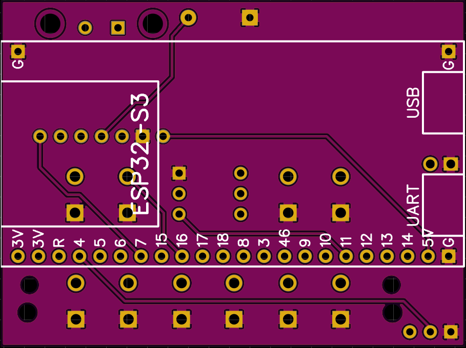
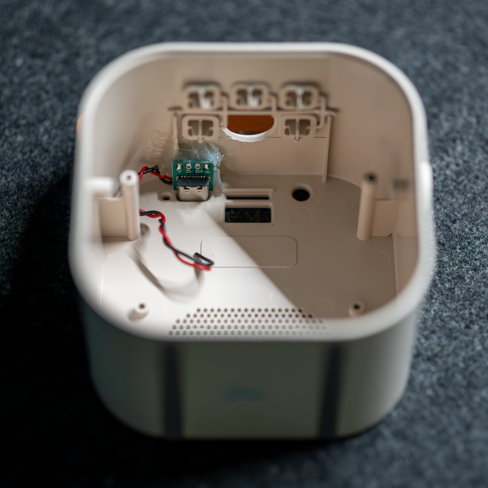

# Karaoke Assistant

This projects aims to give a guide to turn a K12 Karaoke Speaker from AliExpress into a fully functional voice assistant using ESPHome and Home Assistant.

## BOM

This is going to be an extremely short list as I tried to use readily available modules that should fit like a glove into the PCB.

- K12 Karaoke Speaker ([Link to AliExpress](https://www.aliexpress.com/item/1005007178210183.html))
  - _Choose the 1 mic version as you won't need it at all_
- ESP32-S3 Development Board N16R8 ([Link to AliExpress](https://www.aliexpress.com/item/1005006266375800.html))
  - _Might be overkill but it's dirt cheap. Better safe than sorry._
- MAX98357A Module ([Link to AliExpress](https://www.aliexpress.com/item/1005006711010527.html))
- INMP441 Module ([Link to AliExpress](https://www.aliexpress.com/item/1005005933408624.html))
- (5pcs) Tactile Momentary Switch (6x6x5mm) ([Link to AliExpress](https://www.aliexpress.com/item/1005004159746274.html))
- USB-C Breakout Board ([Link to AliExpress](https://www.aliexpress.com/item/1005005776162012.html))
  - _Pick the Type C option_
- (1pc) 100k Resistor (optional)

As of the time of writing (August of 2024), the total cost in parts is around 16€ and around 5€ for 5pcs of the PCB. That's pretty much ridiculous for what you get.

## PCB

First of all, I'm not a PCB designer. I'm a software engineer that likes to tinker. Altough I have done some PCBs in the past, I'm not an expert by any stretch of the imagination. That being said, I'm going to share the PCB I designed for this project.

You can find the Gerber files in the `pcb-design` folder. I used JLCPCB to manufacture the PCBs and they turned out great. Nothing special in terms of the manufactoring options, just the default settings but I did choose the purple color for the PCB because it looks cool and that's very important in an encloused project xD.

|           Front            |           Back           |
| :------------------------: | :----------------------: |
|  |  |

Originally, I wanted to desing the PCB with SMT components so it can be a simple drop-in replacement for the original PCB but after some research, I found out that manufacturing SMT PCBs with assembly is ridiculously expensive for what this is and doing it by hand is a pain and would defeat the purpose of the project. So I decided to go with through-hole components and make it a bit more DIY friendly.

## Schematic

The schematic is pretty simple. The ESP32-S3 is connected to the MAX98357A and the INMP441 modules. The tactile switches are connected to the ESP32-S3 GPIOs.
Some additional connectors and boom, that's it.

## Enclosure modifications

There isn't really much to modify but here are the steps I took to modify the enclosure to fit the new PCB.

1. Disassemble and remove the original PCB. Desolder the LED ring PCB as we will reuse it.
2. Push out the plastic thingy that pushes the switches from the top and drill the second hole from the top row with a 14mm drill bit. I used a step drill bit which is kinda neccesary so the whole remains centered.
   - This whole is for the INMP441 module to fit in.
3. Remove the battery, we won't be using it.
4. Shorten the legs of the plastic thingy, the new PCB is a bit thicker than the original one.

Due to constraints in the PCB design, the USB-C connector couldn't fit on it so I had to use a breakout board. You just solder the power leads with a long enough wire to the PCB and glue the breakout board to the enclosure with some hot glue.
(The easiest way is to place the USB socket to it's opening and connect a USB cable to it so you can keep it in the correct position while the glue hardens.)

In a later revision, I might try to fit the USB-C connector on the PCB.

|  Hole for the INMP441 module  |         USB Type C socket         |
| :---------------------------: | :-------------------------------: |
|  |  |

## Assembly

### Soldering

Obviously, you'll need to have a soldering iron. The order of soldering the components matters as you won't be able to reach some of the pads if you solder the components in the wrong order. Here's the order I suggest:

1. Solder the tactile switches. They only go in one way.
2. Solder the connector pins for the INMP441 module in a way the the long side is facing up. (This way the module will be at the correct height.)
3. Solder the connector pins for the MAX98357A module in the same way.
4. Solder the MAX98357A module itself and then trim the pins.
5. Trim all the pins on the bottom side of the PCB. (We don't want any shorts with the ESP32-S3 module.)
6. Solder the 100k resistor if you want to have a 15dB gain on the MAX98357A module. (I suggest you do.)
7. Solder the ESP32-S3 module.
   - The orientation is suggested by the silkscreen on the PCB.
   - Connect the 22 pin connector to the ESP32-S3 module only on the side that has the actual connections.
   - Solder only a single pin to each corner of the module. This is both for better grounding and to make sure the module is aligned correctly.

### Fitting the microphone

At his point everything is connected except the INMP441 module. This is because we don't know the exact height of the module and we need to adjust the pins accordingly. For this, hot glue the assembly to the speaker enclosure and do a test fit without the plastic button caps.
Align the INMP441 module with the hole and solder the pins in the correct height. Trim the excess.

You can now remove some material from the plastic button caps that pushes the buttons.

### Final assembly

Now you can put everything together. There are three additional connections you need to make:

1. Connect the LED ring PCB to the Karaoke Assistant PCB.
2. Connect the speaker to the MAX98357A module. (You might need to solder longer wires to the speaker.)
3. Connect the USB-C breakout board to the Karaoke Assistant PCBs power source pins.

## Software

The software part was trickier than I expected. It is based on ESPHome and Home Assistant and I also based it on the new [voic-kit](https://github.com/esphome/voice-kit) project from Nabu Casa that's supposed to make it easier to create voice assistant projects with ESPHome with a prebuilt ESP32 board with an XMOS chip. I'm not sure when it will be released or what the availability and cost will be so I think this project is still relevant.

You can find the firmware in the `karaoke-assistant.yaml` file that you need to compile with ESPHome and upload to the ESP32-S3 module. I'm not going to go into details on how to do that as there are plenty of tutorials on the internet.

One additional caveat is that you can't use a `media_player` entity in ESPHome if you are using the `micro_wake_word` component. That's a huge bummer as I wanted to have this as a media player in Home Assistant so I can make announcements and play music on it but most importantly, I wanted to use the `media_player.volume_set` service to control the volume, that is not available when using the `speaker` component.
Fortunately the [esphome_audio](https://github.com/gnumpi/esphome_audio) custom component can be used to create a `media_player` entity that uses ADF to play audio and it is compatible with the `micro_wake_word` component.

Please dig into the `karaoke-assistant.yaml` file to see how it's configured and give me feedback if you have any suggestions.

## TODO

- [ ] Add a USB-C connector to the PCB.
- [ ] Add timers to the firmware
